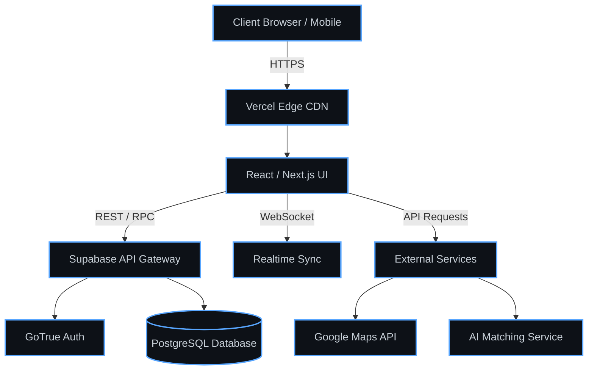

# Cater Connect: Architecture & Technical Showcase

> **Note:** The source code for Cater Connect is hosted in a private repository as it is an active startup project. This document serves as a technical showcase of the platform's system design, features, and engineering standards.

  
  

 

## 📖 System Overview

**Cater Connect** is an AI-powered event workforce marketplace designed to bridge the gap between event organizers and skilled professionals. The platform streamlines the entire lifecycle of event staffing, from AI-driven talent matching to scheduling and management.

Built with a focus on scalability and user experience, Cater Connect leverages a modern, serverless architecture to ensure high availability and rapid feature iteration.

## 🏗️ Architecture Diagram

## ✨ Core Engineering Features

- **Algorithmic Matching:** Implemented algorithms that map workforce availability to specific event requirements based on hard skills, location radii, and performance metrics.
- **State-Synchronized Booking:** Engineered an end-to-end scheduling system with optimistic UI updates and robust server-side validation to prevent double-booking.
- **Geospatial Processing:** Integrated the Google Maps API to calculate accurate proximity vectors and travel time estimations for distributed workforces.
- **Performant UI:** Architected a premium, dark-mode optimized user interface using Tailwind CSS and strict accessibility (a11y) standards.

## 🛠️ Tech Stack Layering

### Presentation Layer
- **Framework:** React with TypeScript for rigorous compile-time type safety.
- **Styling:** Tailwind CSS for a highly scalable, utility-first design system.
- **State Management:** Custom React Hooks leveraging React Context to minimize prop-drilling.

### Data & Authentication Layer
- **Database:** PostgreSQL (via Supabase) utilizing normalized schemas and complex indexing strategies for fast read operations.
- **Security:** Implemented Row Level Security (RLS) policies directly on the database level to ensure tenant data isolation.
- **Authentication:** Token-based JWT flow seamlessly managed by Supabase Auth.

## 📸 Platform Previews

> *(Place your actual screenshots in an `assets/` folder and update these paths. I have left placeholders so the layout is ready for you).*

  
   
  <em>Fig 1. Real-time Dashboard and Workforce Analytics</em>

 

  
   
  <em>Fig 2. AI-powered Talent Matching Interface</em>

## 🗺️ Engineering Roadmap

- [ ] **Phase 2:** Complete migration from mock data layers to live production APIs.
- [ ] **Phase 3:** Integrate an advanced LLM orchestration layer for predictive staffing demand.
- [ ] **Phase 4:** Expand transactional capabilities with automated payout pipelines.
- [ ] **Phase 5:** Build out a native mobile client using React Native / Expo.

---
*Engineered by [Akash Sudhakar](https://github.com/akashsudhakar085-web).*
